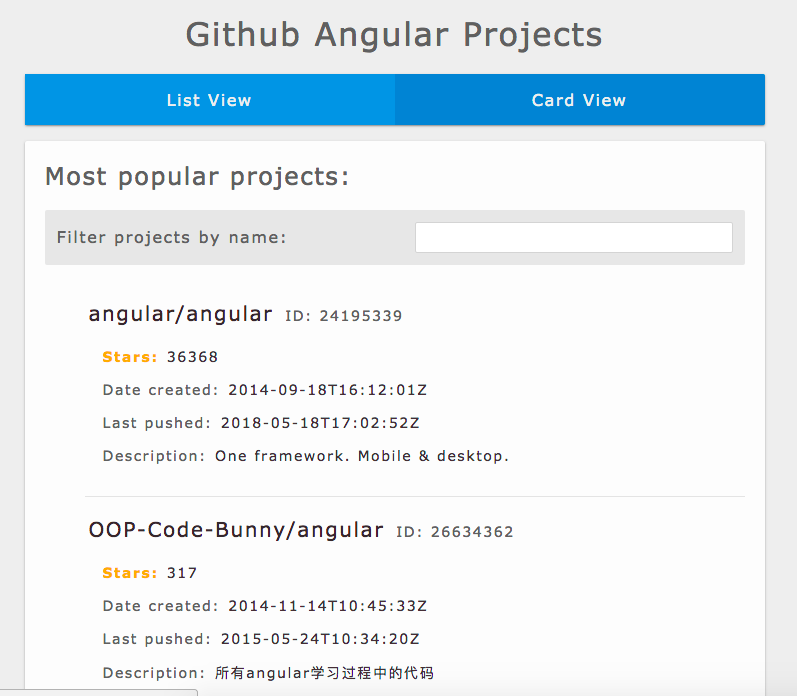
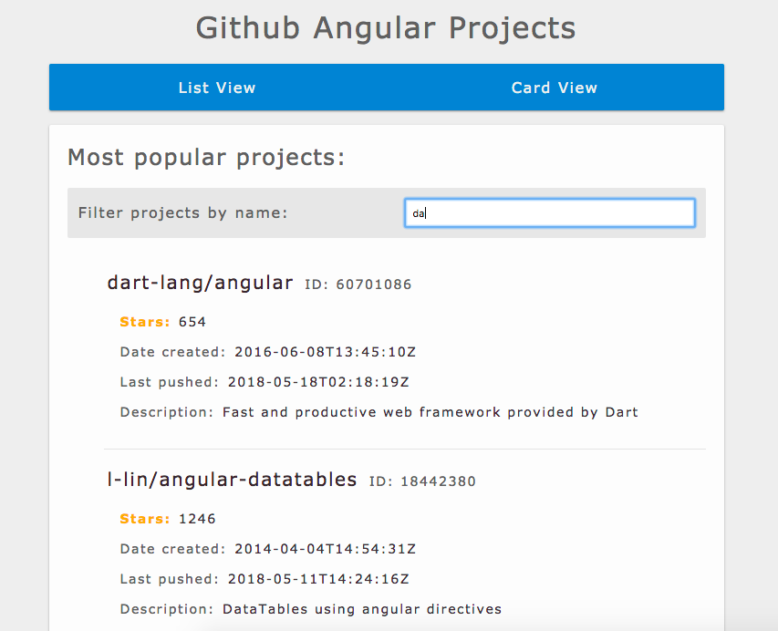
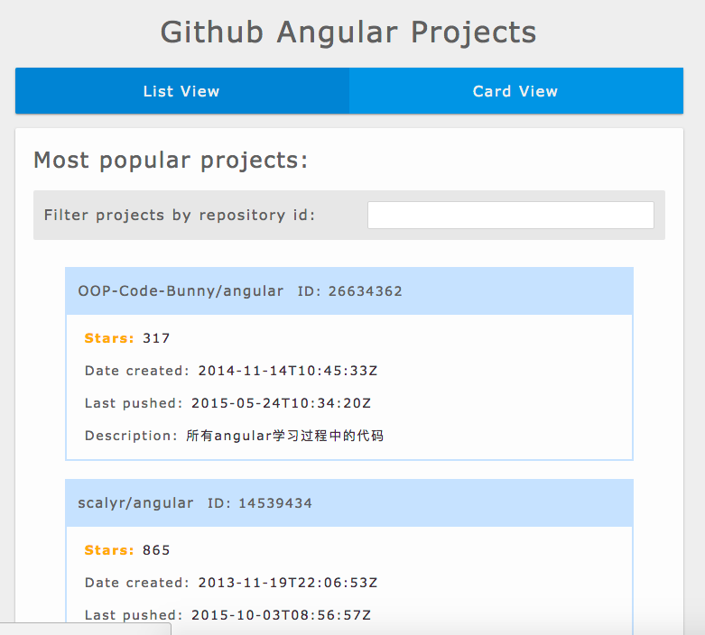
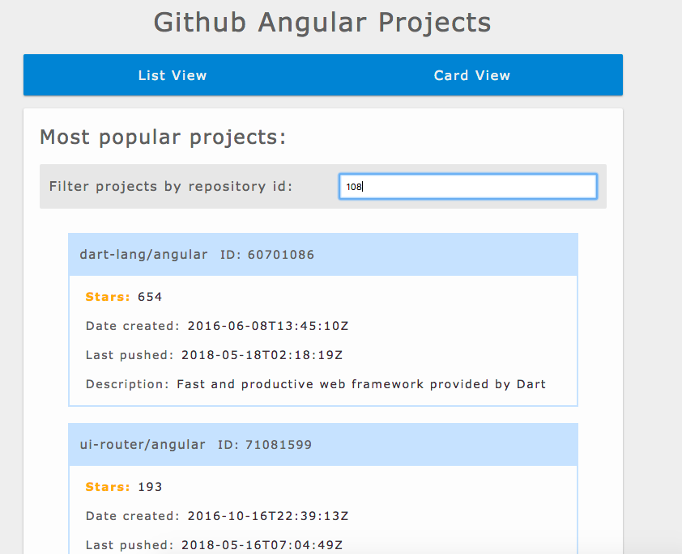

# Angular Github Projects
This project uses the GitHub API to retrieve the most starred public Angular projects and displays them in two different ways. You can also filter by name and by id.

This project was generated with [Angular CLI](https://github.com/angular/angular-cli) version 6.0.1.

## Architecture

In addition to the main app component, this project uses two other components (project and card) for the two different views. It uses the github API and a service to retrieve the list of projects. 

For the filtering, it uses two pipes that takes in user input with the ngModel directive (from the html) and filters through the names or ids of the repositories in order to display the filtered projects. 

## Installation and Development Environment

Install Node.js® and npm if they are not already on your machine.
Then install the Angular CLI globally.

```
npm install -g @angular/cli
```
Then git clone the repo, go to the application directory and launch the server. 
```
cd angular-github-projects
ng serve --open
```

## Screenshots



